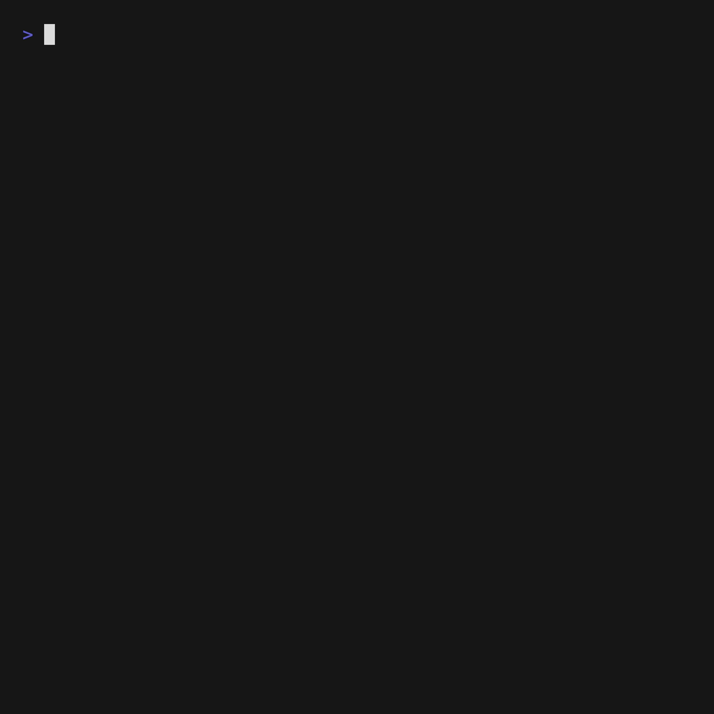

# MakeMe
Create 3D files in the CLI with Small Language Model




# Features

- **Text-to-3D Generation**: Enter 2-5 words to create ASCII art objects
- **STL File Viewer**: Type 'pikachu' to view and interact with real 3D STL files
- **Auto-rotation**: Models rotate automatically with pause/resume controls
- **Responsive Design**: 3D viewport automatically fits your terminal size
- **Interactive Controls**: Manual rotation, wireframe/solid toggle, and more

# How to Run

```bash
# Build the application
go build -o makeme .

# Run it
./makeme
```

# How it works

- Enter 2-5 words to describe an object (e.g., 'a duck', 'a car')
- The app generates ASCII art representation
- Special: Type 'pikachu' to load and view the included STL file
- Use keyboard controls to interact with the 3D model

# Libraries to use (all CLI by Charm.sh)
Bubble Tea: https://github.com/charmbracelet/bubbletea
Lip Gloss: https://github.com/charmbracelet/lipgloss
Bubbles: https://github.com/charmbracelet/bubbles
Harmonica: https://github.com/charmbracelet/harmonica

# Words to live by

Build simple and easy to read & modify code. Keep it stupid simple.
Prioritize joy and additive design.
